# 2022年1月11日美赛学习

## 目标

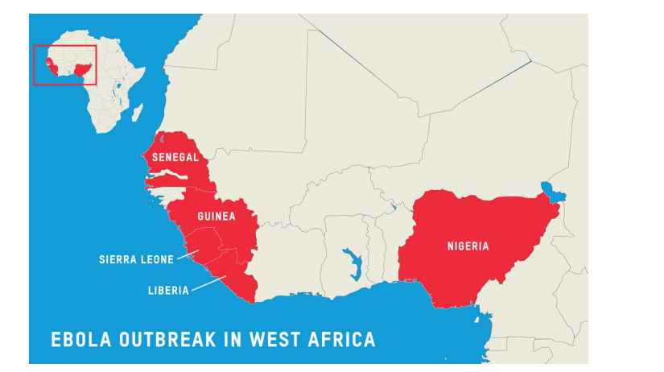

## 画行政版图

使用shaperead函数

在GADM中下载数据文件, 网址如下, 不过只支持单个国家的, 并且没有尊重版图完整.... 

下载链接

https://gadm.org/download_country_v3.html

(单个国家的)

https://www.naturalearthdata.com/

(内容比较丰富, 但是还没有细看)

直接使用m_map的相关函数能够得到版图

```matlab
M=m_shaperead('C:\Users\86176\Desktop\m_map\data\gadm36_CHN_shp\gadm36_CHN_1'); 
clf; 
for k=1:length(M.ncst)
     line(M.ncst{k}(:,1),M.ncst{k}(:,2)); 
end
```

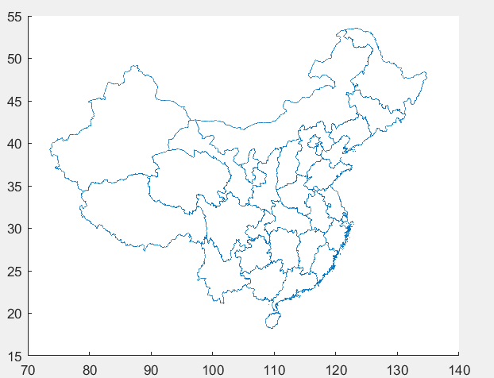

但是仍然不能指定省份....

如何指定省份?? 猜测, 使用名字定位,使用经纬度定位? 怎么填充他?


# 2022年1月12日美赛学习

## matlab 配色问题

一个关于配色的知乎专栏

https://zhuanlan.zhihu.com/p/58810578

一点配色网站

https://flatuicolors.com/

https://materialui.co/colors/

http://brandcolors.net/

https://colorbrewer2.org/#type=sequential&scheme=BuGn&n=3

(这个是colorbrewer的网站, 也就是fzdl上次展示的那个)

fzdl在latex中的配色, 也可迁移到matlab中

```latex
\definecolor{plum}{rgb}{0.36078, 0.20784, 0.4}
\definecolor{chameleon}{rgb}{0.30588, 0.60392, 0.023529}
\definecolor{cornflower}{rgb}{0.12549, 0.29020, 0.52941}
\definecolor{scarlet}{rgb}{0.8, 0, 0}
\definecolor{brick}{rgb}{0.64314, 0, 0}
\definecolor{sunrise}{rgb}{0.80784, 0.36078, 0}
\definecolor{lightblue}{rgb}{0.15,0.35,0.75}
```

fzdl提供的另一组配色

```
   darkred,     0.643,0.000,0.039 / 0.00 ;
   red,         0.702,0.259,0.090 / 0.00 ;
   orange,      0.918,0.506,0.255 / 0.00 ;
   yellow,      0.949,0.741,0.243 / 0.00 ;
   green,       0.639,0.718,0.251 / 0.00 ;
   teal,        0.000,0.667,0.388 / 0.00 ;
   blue,        0.024,0.318,0.608 / 0.00 ;
   purple,      0.380,0.259,0.514 / 0.00 ;
   darkpurple,  0.325,0.012,0.416 / 0.00 ;
```

### matlab怎么修改配色

首先check一下matlab的原版默认配色方案

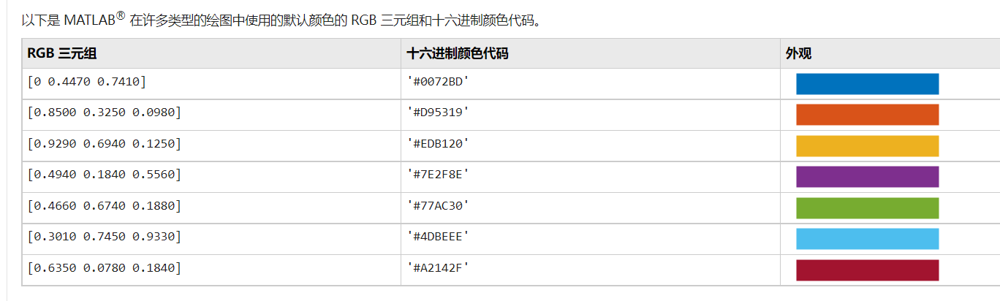

其实也不是很丑, 但是画出来咋就有的那么丑


经过搜索得到一个工具**cbrewer** https://zhuanlan.zhihu.com/p/353749546,

它可以

- 在Matlab 中使用**命令来查看不同的配色方案**；
- **生成**某一种**配色方案的RGB** 表格，并应用于绘图；
- 允许通过插值(interp1插值方法) RGB 索引来为每个色表使用**可变数量的颜色。**

cbrewer , 发散类型, 连续类型, 定性类型

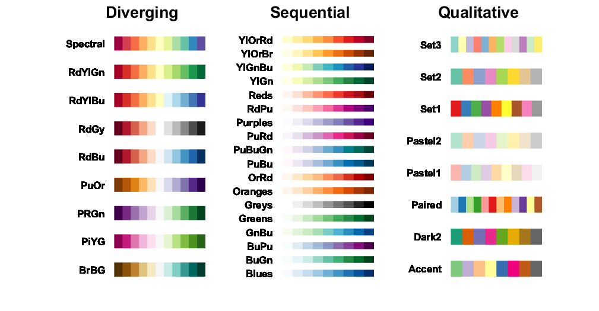

获得配色方案```RGB = cbrewer('配色方案类型', '具体配色方案', 颜色个数, '插值方法')```

```matlab
RGB = cbrewer('seq', 'Greens', 10, 'linear');% 生成一个配色方案的RGB矩阵
x = linspace(-1,1,100);% 自变量x
for a = 1:10
plot(x, a.*x.^2, 'Color', RGB(a,:), 'LineWidth', 2);
hold on;
end
```

生成配色方案直接用于colormap

```matlab
RGB=cbrewer('seq', 'PuBu', 100, 'linear');   % 生成PuBu的配色方案的RGB矩阵
colormap(RGB); % 将RGB配色用于colormap
```

举个例子, 切换前后

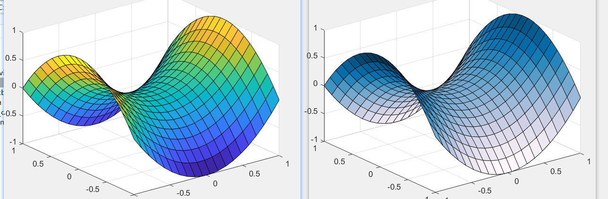


## 继续昨天的画行政版图

使用m_shaperead和原生的shaperead都可以

```matlab
M=m_shaperead('C:\Users\86176\Desktop\m_map\data\gadm36_CHN_shp\gadm36_CHN_1'); 
tf = fieldnames(M);
class(M.dbfdata{1,4}) ;  % 名字是dbfdata的第四列

for k=1:length(M.ncst)
    if(strcmp(M.dbfdata{k,4}, 'Jiangxi') ~= 0)
     patch(M.ncst{k}(:,1),M.ncst{k}(:,2),'red');
    end
     line(M.ncst{k}(:,1),M.ncst{k}(:,2));
end
```

用patch进行填充, area不行, fill勉强可以, 不过应该是patch的问题, 对于一些省份没有画出圈.(原因暂时未知.), 不过应该能应付大部分情况.

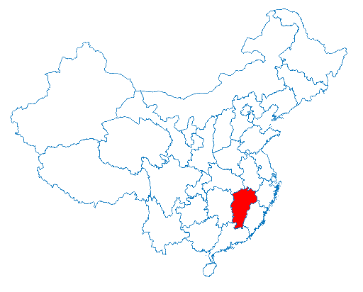

如何实现放大效果

去官网下载的magnify函数, 先使用鼠标放大,然后使用可视化的方式进行位置的移动 

不要忽视了matlab的gui操作!!

参考了这个链接 https://blog.csdn.net/schwein_van/article/details/78513908


#### 坐标轴的各种操作

```matlab
h = figure;
ax = axes('Parent',h)                      
ax.YAxis.Visible = 'off'
ax.XAxis.Visible = 'off'
```

原理是直接从句柄去控制x和y的显示, 啥都不显示

```matlab
set(gca,'xticklabel',[],'yticklabel',[],'xtick',[],'ytick',[])
```

原理是用set函数去设置gca, xticklabel是显示的刻度值, xtick是刻度, 但是xy的一横一竖还是在的

```matlab
axis off
```

直接关掉, 但是这个关不只是关坐标轴, 还把一些其他需要的线也取消了. 有时会出现一些问题.


#### 图片大小和位置的操作 

**matlab 的图片大小三层结构 screen > figure > axis.**

**figure由screen变化而变化, axis由figure变化而变化 , figure是我的窗口大小**

- 设置axis在figture中的边距

```set (gca,'position',[0.1,0.1,0.8,0.8] );%设置坐标轴在figture中的边距,```

四个参数分别表示的是左边界，下边界，高度，宽度。

- 设置figture窗口的形状（默认为近似正方形）

```set(gcf,'unit','normalized','position'，[0.2,0.2,0.64,0.32]); %其在屏幕上的显示，```

四个参数分别表示的是左边界，下边界，高度，宽度。

```matlab
figure
set(gcf,'unit','normalized','position',[0.1,0.1,0.8,0.5]);%figture位置，最下角，宽高
set (gca,'position',[0.1,0.1,0.8,0.8] );%axis位置，最下角，宽高
x=1:0.1:10;
y=sin(x);
plot(x,y)
```

#### final结果

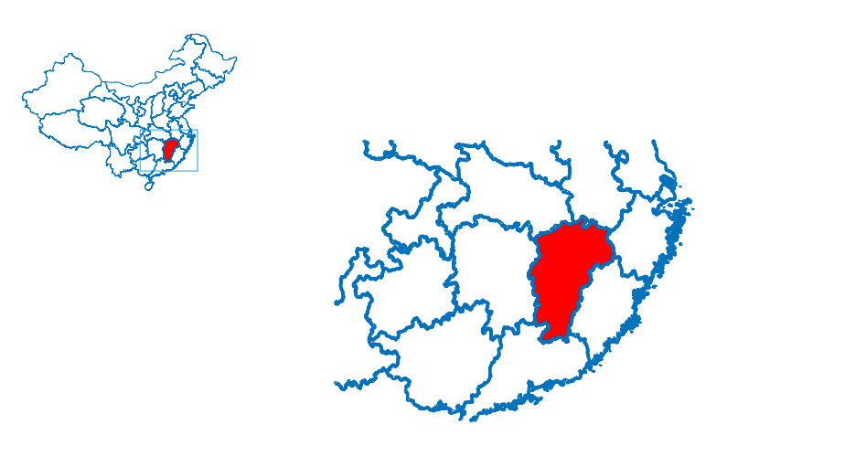

代码如下

```matlab
M=m_shaperead('C:\Users\86176\Desktop\m_map\data\gadm36_CHN_shp\gadm36_CHN_1'); 
tf = fieldnames(M);
class(M.dbfdata{1,4}) ;  % 名字是dbfdata的第四列

h = figure;
ax = axes('Parent',h);                      
ax.YAxis.Visible = 'off';
ax.XAxis.Visible = 'off';
set(gcf,'unit','normalized','position',[.2 .2 .64 .64],'color','white') % figure
set(gca,'position',[0 .55 .25 .35])  % axis

for k=1:length(M.ncst)
    if(strcmp(M.dbfdata{k,4}, 'Jiangxi') ~= 0) %返回值和c相反就离谱
   
     patch(M.ncst{k}(:,1),M.ncst{k}(:,2),'red');
    end
     line(M.ncst{k}(:,1),M.ncst{k}(:,2));
end

magnify
```

配合gui方法

这种方法有较多的gui操作, 不酷属于是.., 了解一下方法二

#### figure子图的方法二

MATLAB文档中axes函数的解释为Create axes graphics object，即创建坐标轴图形对象。其中有一个功能Position Multiple Axes in Figure Window可以Create multiple axes in a single figure window and specify their positions，也就是可以在一幅图形窗口内创建多个坐标轴并指定它们的位置。

axes('Position',[subNormalxLabel,subNormalyLabel,normalWidth,normalHeight])

其中，subNormalxLabel为子图左下角位置的归一化横坐标，subNormalxLabel为子图左下角位置的归一化纵坐标，计算公式为：
subNormalxLabel = （该位置的横坐标-横坐标起始值）/横坐标量程
subNormalyLabel = （该位置的纵坐标-纵坐标起始值）/纵坐标量程
normalWidth为子图的归一化宽度，normalHeight为子图的归一化高度，计算方式类似。

MATLAB给出的一个示例代码：

```matlab
axes('Position',[0.1,0.1,0.7,0.7])
contour(peaks(20))

axes('Position',[0.65,0.7,0.28,0.28])
surf(peaks(20))
```

效果图如下 , 但是似乎, 用于放大的话, 还是gui更香

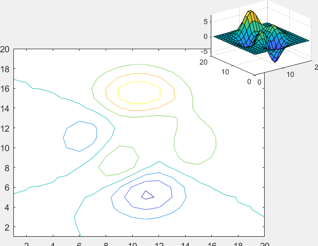


## 另一个目标(来自QQ群里)

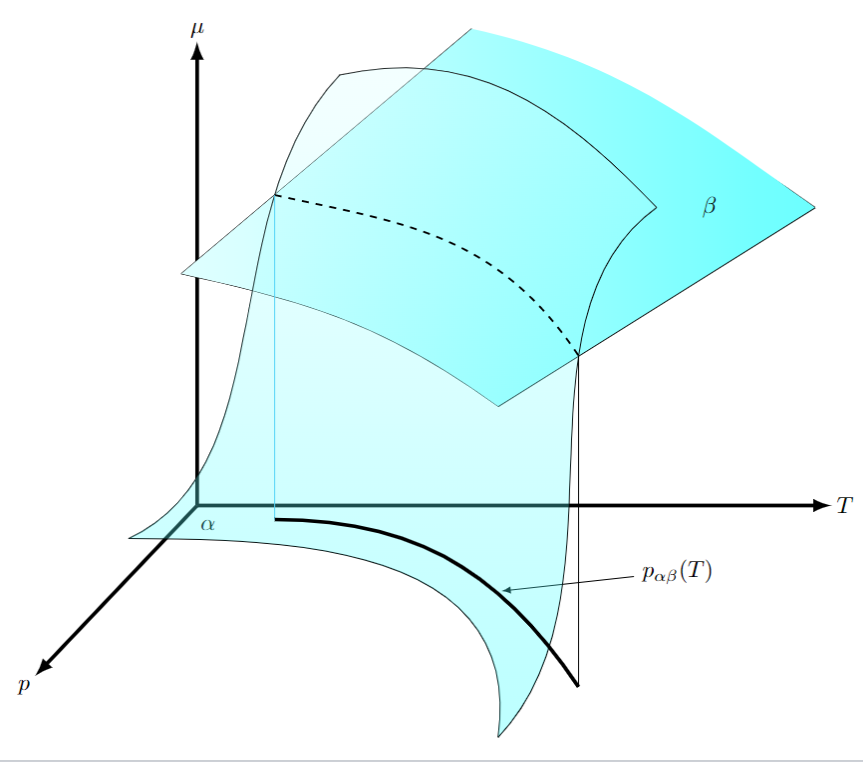

试图直接模仿, 但是没有函数式子, 所以就试试看了, 两个平面交叉, 画交线在xoy平面的投影

二维情况下怎么画交点?

先画出图 ,然后根据范围fsolve或者直接solve啥的, 然后单独去画点


三维下呢?

因为surf函数plot3函数本质上应该是插值的..... 应该不合适用来求值...

困难: 怎么求到交线(还得考虑共面)? 遍历? 粒度不够

问吧hhh


搜索得到 , 若是直接求三维平面的交线, 可以直接通过他们的法向量, 方向向量等数学方法 用cross求出交线的向量, 再代入个点

网络上较多还是数学可求解的...


# 2022年1月13日美赛学习

### matlab数学建模方法与实践阅读记录

(待会开会记得提醒还书)

因为不知道该画什么了, 打算过一遍之前发的《matlab数学建模方法与实践阅读记录》

飞快的过一遍，在这里稍加记录

### ch2

xlsread函数的使用， emmm这个函数已经不推荐使用了。

取而代之的使用readtable ， readmatrix和readcell

readtable基于文件创建表

正常使用readtable函数即可

```matlab
T = readtable(filename) % 正常的读取
% 会自动将表格文件的第一行作为变量名
% 会自动类似于将文件调用detectImportOptions函数
% 删除多余的列标题，使用适当的缺失值填补空缺
```

还原以前的版本的默认行为，请指定 `'Format','auto'` 名称-值对组参数。`readtable` 会将标题作为数据读取，因此，它会将所有表变量均转换为文本。

```
T = readtable('headersAndMissing.txt','Format','auto')
```

一些更细的内容， 就遇到文件再说

### ch3

#### 标注方法

学到一个标注的方法，使用到line函数的marker参数， 猜测应该是两端点形状。 类似于下图中的标注， 用来标注平均值， 中位数位置等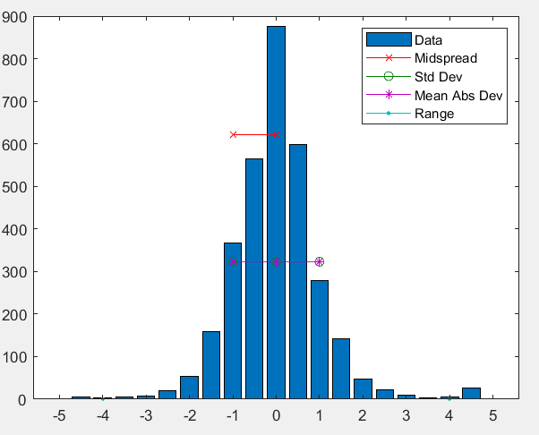

#### 一个很酷的代码

一个能打印很酷的图片的代码

```matlab
clc, clear al, close all
X=xlsread('dataTableA2.xlsx');
Vars = X(:,7:12);
%  绘制变量间相关性关联图
figure
plotmatrix(Vars)
%  绘制变量间相关性强度图
covmat = corrcoef(Vars);
figure
imagesc(covmat);
grid;
colorbar;
```

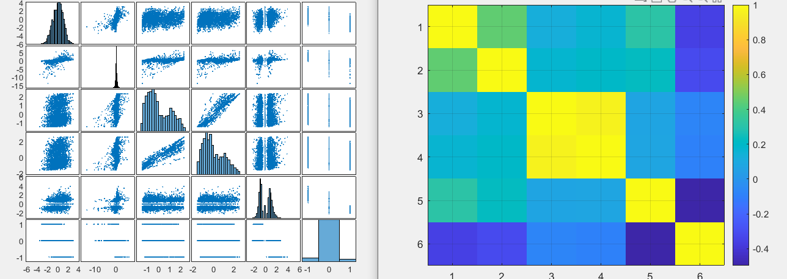


主要是左边这个图很帅， 一次能有这么多图，

使用的是plotmatrix函数

`plotmatrix(X,Y)` 创建一个子坐标区矩阵，包含了由 `X` 的各列相对 `Y` 的各列数据组成的散点图。如果 `X` 是 *p*×*n* 且 `Y` 是 *p*×*m*，则 `plotmatrix` 生成一个 *n*×*m* 子坐标区矩阵。

这里是plotmatrix(X)的情况

创建包含随机数据的散点图矩阵。矩阵的第 i 行、第 j 列中的子图是 `X` 的第 i 列相对于 `X` 的第 j 列的散点图。沿对角线方向是 `X` 的每一列的直方图。

corrcoef函数计算相关系数的矩阵

此处使用的是imagesc实现的， 但是我不喜欢imagesc我喜欢pcolor

#### 箱型图

之前没有注意，使用boxplot即可**(颜色参数)**

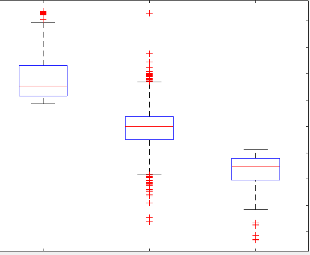

箱型图的用法， 用于看数据分布

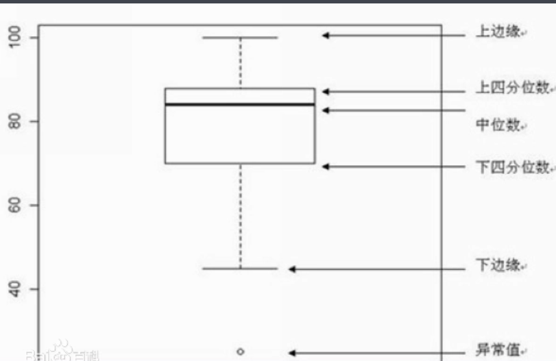

#### PCA的示例代码

```matlab
A=xlsread('Coporation_evaluation.xlsx', 'B2:I16');

% Transfer orginal data to standard data
a=size(A,1);   % Get the row number of A
b=size(A,2);   % Get the column number of A
for i=1:b
    SA(:,i)=(A(:,i)-mean(A(:,i)))/std(A(:,i));  % Matrix normalization
end

% Calculate correlation matrix of A.
CM=corrcoef(SA);

% Calculate eigenvectors and eigenvalues of correlation matrix.
[V, D]=eig(CM);

% Get the eigenvalue sequence according to descending and the corrosponding
% attribution rates and accumulation rates.
for j=1:b
    DS(j,1)=D(b+1-j, b+1-j);
end
for i=1:b
    DS(i,2)=DS(i,1)/sum(DS(:,1));
    DS(i,3)=sum(DS(1:i,1))/sum(DS(:,1));
end

% Calculate the numvber of principal components.
T=0.9;  % set the threshold value for evaluating information preservation level.
for K=1:b
    if DS(K,3)>=T
        Com_num=K;
        break;
    end
end

% Get the eigenvectors of the Com_num principal components
for j=1:Com_num
    PV(:,j)=V(:,b+1-j);
end

% Calculate the new socres of the orginal items
new_score=SA*PV;

for i=1:a
    total_score(i,2)=sum(new_score(i,:));
    total_score(i,1)=i;
end
new_score_s=sortrows(total_score,-2);

%% 显示结果
disp('特征值及贡献率：')
DS
disp('阀值T对应的主成分数与特征向量：')
Com_num
PV
disp('主成分分数：')
new_score
disp('主成分分数排序：')
new_score_s

```

#### ch4

logitic的示例代码

```matlab
% 程序P7-1： logistic方法Matlab实现程序
% 《MATLAB数学建模方法与实践》(《MATLAB在数学建模中的应用》升级版)，北航出版社，卓金武、王鸿钧编著. 
%% 数据准备
clear all
clc
X0=xlsread('logistic_ex1.xlsx', 'A2:C21'); % 回归数据X值
XE=xlsread('logistic_ex1.xlsx', 'A2:C26'); % 验证与预测数据
Y0=xlsread('logistic_ex1.xlsx', 'D2:D21'); % 回归数据P值
%--------------------------------------------------------------------------
%% 数据转化和参数回归
n=size(Y0,1);
for i=1:n
    if Y0(i)==0
        Y1(i,1)=0.25;
    else
        Y1(i,1)=0.75;
    end
end
X1=ones(size(X0,1),1); % 构建常数项系数
X=[X1, X0];
Y=log(Y1./(1-Y1));
b=regress(Y,X);
%--------------------------------------------------------------------------
%% 模型验证和应用
for i=1:size(XE,1)
    Pai0=exp(b(1)+b(2)*XE(i,1)+b(3)*XE(i,2)+b(4)*XE(i,3))/(1+exp(b(1)+b(2)*XE(i,1)+b(3)*XE(i,2)+b(4)*XE(i,3)));
    if Pai0<=0.5
       P(i)=0;
    else 
       P(i)=1;
    end
end
%--------------------------------------------------------------------------
%% 显示结果
disp(['回归系数:' num2str(b')]);
disp(['评价结果:' num2str(P)]);
```

线性回归和 多元回归的代码也在这里ch4, 此处就不贴了.

#### ch5

这一章很多代码都不能跑, 因为我是r2020b版本. 而书中代码是在2014版本下编写的,

纠结一波是把代码改了还是再装一个matlab2014

这一章, 包含了**分类器** , **聚类器** ,**深度学习**, 不知道为啥还单独搞了个k-means不过因为涉及详细算法且版本不通, 暂时没有深究

#### ch6  && ch7

就一个灰色预测

就一个混合整数线性规划求解

#### ch8

模拟退火算法

旅行商问题

#### ch9

蚁群算法

#### ch10

waveEquation (描述波浪运动的)波动方程;

#### ch11

多因子选股模型

AHP法权重计算

#### ch12

元胞自动机

#### ch13

2002年的cumcm彩票问题求解程序

#### ch14

2003CUMCM露天矿卡车调度系统求解程序

......后面都是一些解题程序了


### 昨天的行政版图的一点问题

在部分省份会失效

尝试了, 将所有标红,发现不可行

会没有显示红色, 

> 如果坐标数据不能定义封闭的多边形，patch函数自动使多边形封闭。数据能定理凹面或交叉的多边形。然而，如果单个补片面的边缘相互交叉，得到的面可能不会完全填充。在这种情况下，最好将面分解为更小的多边形。

但是此处我并不能直接将其变成多个小多边形

暂时没有找到合适的方法解决... 使用fill函数也没有效果, 可能需要深究

### python的folium库

之前在smm中用到过

此处使用的结果是, 没有反应


# 2022年1月14日美赛学习

### html能否转pdf?

因为发现很多python的库生成的都是html文件...... 

html能否转化为pdf非常重要.

找到了几个转换的网站, 但是以昨天folium库生成的html文件效果都不佳

https://html2pdf.com/ 直接上传文件转换

https://abcdpdf.com/html-to-pdf.html#url 只支持将url转换(并且不支持我的服务器ip, 支持域名, ), 并且速度较慢 ,但是效果很差

https://www.sejda.com/html-to-pdf  出来的图不是矢量图


个人的一点小看法, 因为html交互性和所包含的内容远多于一张图, 所以直接转换肯定会不满意, 因为pdf虽然也支持js,但是很难达到原生html的效果

### python可视化

试图跟的一篇博客

https://blog.csdn.net/qq_46614154/article/details/106255835

但是没有数据集

#### pyvis库

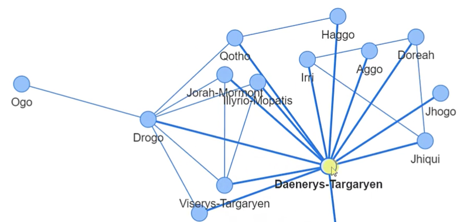


https://pyvis.readthedocs.io/en/latest/tutorial.html

文档中的一个代码

```python
from pyvis.network import Network
import pandas as pd

got_net = Network(height='750px', width='100%', bgcolor='#222222', font_color='white')

# set the physics layout of the network
got_net.barnes_hut()
got_data = pd.read_csv('https://www.macalester.edu/~abeverid/data/stormofswords.csv')

sources = got_data['Source']
targets = got_data['Target']
weights = got_data['Weight']

edge_data = zip(sources, targets, weights)

for e in edge_data:
    src = e[0]
    dst = e[1]
    w = e[2]

    got_net.add_node(src, src, title=src)
    got_net.add_node(dst, dst, title=dst)
    got_net.add_edge(src, dst, value=w)

neighbor_map = got_net.get_adj_list()

# add neighbor data to node hover data
for node in got_net.nodes:
    node['title'] += ' Neighbors:<br>' + '<br>'.join(neighbor_map[node['id']])
    node['value'] = len(neighbor_map[node['id']])

got_net.show('gameofthrones.html')
```


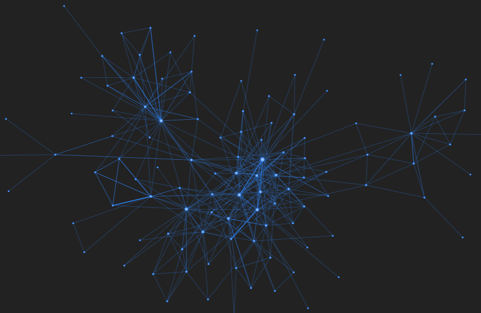


#### 饼图(环形)

真的....太丑了

```python
import matplotlib.pyplot as plt

plt.rcParams['font.family'] = 'SimHei'

x = [1, 5, 4, 3]
labels = ['a', 'b', 'c', 'd']

plt.subplot(121)
plt.pie(x, labels=labels)
plt.title("饼图")

plt.subplot(122)
plt.pie(x, labels=labels, wedgeprops={
    'width': 0.5})
plt.title("圆环图")

plt.show()

## 标注
fig, ax = plt.subplots(figsize=(6, 3), subplot_kw=dict(aspect="equal"))

recipe = ["225 g flour",
          "90 g sugar",
          "1 egg",
          "60 g butter",
          "100 ml milk",
          "1/2 package of yeast"]

data = [225, 90, 50, 60, 100, 5]

wedges, texts = ax.pie(data, wedgeprops=dict(width=0.5), startangle=-40)

bbox_props = dict(boxstyle="square,pad=0.3", fc="w", ec="k", lw=0.72)
kw = dict(arrowprops=dict(arrowstyle="-"),
          bbox=bbox_props, zorder=0, va="center")

for i, p in enumerate(wedges):
    ang = (p.theta2 - p.theta1)/2. + p.theta1
    y = np.sin(np.deg2rad(ang))
    x = np.cos(np.deg2rad(ang))
    horizontalalignment = {-1: "right", 1: "left"}[int(np.sign(x))]
    connectionstyle = "angle,angleA=0,angleB={}".format(ang)
    kw["arrowprops"].update({"connectionstyle": connectionstyle})
    ax.annotate(recipe[i], xy=(x, y), xytext=(1.35*np.sign(x), 1.4*y),
                horizontalalignment=horizontalalignment, **kw)

ax.set_title("Matplotlib bakery: A donut")

plt.show()
```

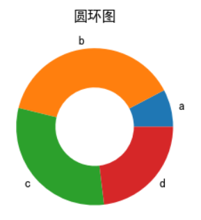

还有python上的标注也很丑

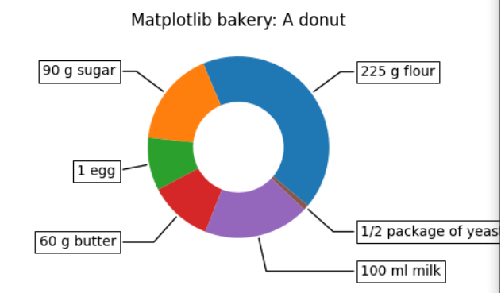

然后matlab中甚至还没有找到


