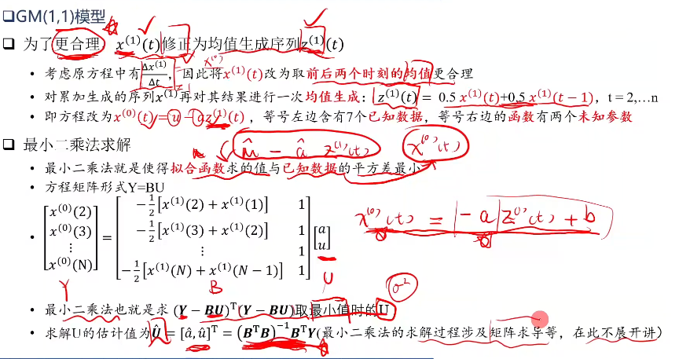

## 元胞自动机

### 相关论文与书籍位置: 

- 2020年B题2007698(沙子城堡),  

- 2020年A题2007799(海鱼迁徙),

- 美国大学生数学建木竞赛题解析与研究1, 202页, 飞机就坐问题

### 简单代码模板

```matlab
close;
clear;
clc;

n = 300;     %元胞矩阵大小
Plight = 0.01; Pgrowth = 0.1;
UL = [n 1:n-1];
DR = [2:n 1];
veg = zeros(n,n);        %// 初始化,各种参数的申明

imh = image(cat(3,veg,veg,veg));   %// 元胞自动机的结果展示方法

for i = 1:100000   % //进行迭代, 控制迭代次数
    sum = (veg(UL,:) >0 & veg(UL,:) < 6) + (veg(:,UL) >0 & veg(:,UL) < 6) + ((veg(DR,:) >0 & veg(DR,:) < 6)) + ((veg(:,DR) >0 & veg(:,DR) < 6));   % 每个点周围的火势
    
    % ------------------------------------状态转移-----------------------------------------
    % 土地上随机生成树
    a = rand(n,n) < Pgrowth;
    a = a^1;
    veg(find(a==1)) = 6 ;
    
    % 树上随机生成火.rand符合就用5, 否则就6
    a = ((rand(n,n) < Plight)) ;
    a = a^1;
    veg(find(a==1 & veg == 6)) = 5;
    
    % 树被周围的火烧着
    veg(find( (veg == 6 & sum > 0) == 1 )) = 5;
    
    % 每个火的火势变化
    veg(find(veg>0&veg<6)) = veg(find(veg>0&veg<6)) - 1;
    
    % -------------------------------------- 画图展示 ---------------------------------------
    set(imh, 'cdata', cat(3, veg>0&veg<6,veg == 6 ,zeros(n,n)));
    drawnow;
    
    % ------------------------ 相关的可视化曲线图等 --------------------------
    figure(2);
    a = length(find(veg>0&veg<6));
    b = length(find(veg==6));
    fire(i) = a;
    tree(i) = b;
    plot(1:i,fire,1:i,tree);
    legend(['绿树的数量',num2str(b)],['火的数量',num2str(a)]);
    title(['时间T=',num2str(i),'天']);
    
    pause(0.1); % 重要, 否则会无法成功展示
end
```


## 主成分分析(PCA)


### 简单模板

```matlab
clc;
clear;
close all;

[X,y] = iris_dataset();
X = X';
y = vec2ind(y)';

m = 2;
[U,Z] = pca(X,'NumComponents',3);  % 注意pca的输入的矩阵行列

scatter3(Z(:,1),Z(:,2),Z(:,3),25,y,'filled');
colormap(jet);
```

为何m选取3 ? 维度选取的合理性

```matlab
[X,y] = iris_dataset();
X = X';
y = vec2ind(y)';
C = cov(X);
[V E] = eig(C);
E = diag(E);
sort(E,'descend');
final = cumsum(e) / sum(e);
plot(final)
```


## 遗传算法(GA)

### 相关内容

2007年有种子.pdf


### 简单模板

app.py

```python
import numpy as np
import matplotlib.pyplot as plt
from ypstruct import structure
import ga

# Sphere Test Function


def sphere(x):
    return sum(x**2)


# Problem Definition
problem = structure()
problem.costfunc = sphere
problem.nvar = 5
problem.varmin = [-10, -10, -1, -5,  4]
problem.varmax = [10,  10,  1,  5, 10]

# GA Parameters
params = structure()
params.maxit = 100
params.npop = 50
params.beta = 1
params.pc = 1
params.gamma = 0.1
params.mu = 0.01
params.sigma = 0.1

# Run GA
out = ga.run(problem, params)

# Results
print(out.pop)
plt.plot(out.bestcost)
# plt.semilogy(out.bestcost)
plt.xlim(0, params.maxit)
plt.xlabel('Iterations')
plt.ylabel('Best Cost')
plt.title('Genetic Algorithm (GA)')
plt.grid(True)
plt.show()

```

ga.py

```python
import numpy as np
from ypstruct import structure

def run(problem, params):
    
    # Problem Information
    costfunc = problem.costfunc
    nvar = problem.nvar
    varmin = problem.varmin
    varmax = problem.varmax

    # Parameters
    maxit = params.maxit
    npop = params.npop
    beta = params.beta
    pc = params.pc
    nc = int(np.round(pc*npop/2)*2)
    gamma = params.gamma
    mu = params.mu
    sigma = params.sigma

    # Empty Individual Template
    empty_individual = structure()
    empty_individual.position = None
    empty_individual.cost = None

    # Best Solution Ever Found
    bestsol = empty_individual.deepcopy()
    bestsol.cost = np.inf

    # Initialize Population
    pop = empty_individual.repeat(npop)
    for i in range(npop):
        pop[i].position = np.random.uniform(varmin, varmax, nvar)
        pop[i].cost = costfunc(pop[i].position)
        if pop[i].cost < bestsol.cost:
            bestsol = pop[i].deepcopy()

    # Best Cost of Iterations
    bestcost = np.empty(maxit)
    
    # Main Loop
    for it in range(maxit):

        costs = np.array([x.cost for x in pop])
        avg_cost = np.mean(costs)
        if avg_cost != 0:
            costs = costs/avg_cost
        probs = np.exp(-beta*costs)

        popc = []
        for _ in range(nc//2):

            # Select Parents
            #q = np.random.permutation(npop)
            #p1 = pop[q[0]]
            #p2 = pop[q[1]]

            # Perform Roulette Wheel Selection
            p1 = pop[roulette_wheel_selection(probs)]
            p2 = pop[roulette_wheel_selection(probs)]
            
            # Perform Crossover
            c1, c2 = crossover(p1, p2, gamma)

            # Perform Mutation
            c1 = mutate(c1, mu, sigma)
            c2 = mutate(c2, mu, sigma)

            # Apply Bounds
            apply_bound(c1, varmin, varmax)
            apply_bound(c2, varmin, varmax)

            # Evaluate First Offspring
            c1.cost = costfunc(c1.position)
            if c1.cost < bestsol.cost:
                bestsol = c1.deepcopy()

            # Evaluate Second Offspring
            c2.cost = costfunc(c2.position)
            if c2.cost < bestsol.cost:
                bestsol = c2.deepcopy()

            # Add Offsprings to popc
            popc.append(c1)
            popc.append(c2)
        

        # Merge, Sort and Select
        pop += popc
        pop = sorted(pop, key=lambda x: x.cost)
        pop = pop[0:npop]

        # Store Best Cost
        bestcost[it] = bestsol.cost

        # Show Iteration Information
        print("Iteration {}: Best Cost = {}".format(it, bestcost[it]))

    # Output
    out = structure()
    out.pop = pop
    out.bestsol = bestsol
    out.bestcost = bestcost
    return out

def crossover(p1, p2, gamma=0.1):
    c1 = p1.deepcopy()
    c2 = p1.deepcopy()
    alpha = np.random.uniform(-gamma, 1+gamma, *c1.position.shape)
    c1.position = alpha*p1.position + (1-alpha)*p2.position
    c2.position = alpha*p2.position + (1-alpha)*p1.position
    return c1, c2

def mutate(x, mu, sigma):
    y = x.deepcopy()
    flag = np.random.rand(*x.position.shape) <= mu
    ind = np.argwhere(flag)
    y.position[ind] += sigma*np.random.randn(*ind.shape)
    return y

def apply_bound(x, varmin, varmax):
    x.position = np.maximum(x.position, varmin)
    x.position = np.minimum(x.position, varmax)

def roulette_wheel_selection(p):
    c = np.cumsum(p)
    r = sum(p)*np.random.rand()
    ind = np.argwhere(r <= c)
    return ind[0][0]
```

## 层次分析法(AHP)

画图的时候注意


```matlab
A = %判断矩阵
[n, n] = size(A);
[V, D] = eig(A); %求得特征向量和特征值
%求出最大特征值和它所对应的特征向量
temp = diag(A);
[n, index] = max(temp)
pos = index

w = abs(V(:, pos));
w = w / sum(w);
t = D(pos, pos);
disp('准则层特征向量w='); disp(w); disp('准则层最大特征根t='); disp(t);
%以下是一致性检验
CI = (t - n) / (n - 1); RI = [0 0 0.52 0.89 1.12 1.26 1.36 1.41 1.46 1.49 1.52 1.54 1.56 1.58 1.59 1.60 1.61 1.615 1.62 1.63];
CR = CI / RI(n);

if CR < 0.10
    disp('此矩阵的一致性可以接受!');
    disp('CI='); disp(CI);
    disp('CR='); disp(CR);
else disp('此矩阵的一致性验证失败，请重新进行评分!');
end

```

## 熵权法

```python
import pandas as pd
import numpy as np
import math
from numpy import array

# 1读取数据
df = pd.read_csv('text.csv', encoding='gb2312')
# 2数据预处理 ,去除空值的记录
df.dropna()

# 定义熵值法函数


def cal_weight(x):
    '''熵值法计算变量的权重'''
    # 标准化
    x = x.apply(lambda x: ((x - np.min(x)) / (np.max(x) - np.min(x))))
    # 此处是否需要修改

    # 求k
    rows = x.index.size  # 行
    cols = x.columns.size  # 列
    k = 1.0 / math.log(rows)

    lnf = [[None] * cols for i in range(rows)]

    # 矩阵计算--
    # 信息熵
    # p=array(p)
    x = array(x)
    lnf = [[None] * cols for i in range(rows)]
    lnf = array(lnf)
    for i in range(0, rows):
        for j in range(0, cols):
            if x[i][j] == 0:
                lnfij = 0.0
            else:
                p = x[i][j] / x.sum(axis=0)[j]
                lnfij = math.log(p) * p * (-k)
            lnf[i][j] = lnfij
    lnf = pd.DataFrame(lnf)
    E = lnf

    # 计算冗余度
    d = 1 - E.sum(axis=0)
    # 计算各指标的权重
    w = [[None] * 1 for i in range(cols)]
    for j in range(0, cols):
        wj = d[j] / sum(d)
        w[j] = wj
        # 计算各样本的综合得分,用最原始的数据

    w = pd.DataFrame(w)
    return w


if __name__ == '__main__':
    # 计算df各字段的权重
    w = cal_weight(df)  # 调用cal_weight
    w.index = df.columns
    w.columns = ['weight']
    print(w)
    print('运行完成!')

```

### 与层次分析法的结合

构造层次模型，对某些有客观数据的评价指标，使用熵权法得到它们的权重，并转换为AHP判断矩阵中的两两比较数据，最后计算得到AHP总排序权重；

或者更直接一些，对于某些有合适客观数据的评价指标，使用熵权法得到它们的权重；为其他评价指标构造[层次模型](https://www.zhihu.com/search?q=层次模型&search_source=Entity&hybrid_search_source=Entity&hybrid_search_extra={"sourceType"%3A"answer"%2C"sourceId"%3A376687323})，用层次分析法得到它们的权重，最后把所有评价指标的权重融合到一块。


## 灰色预测模型(此处为GM(1,1))

GM(1,1), 适用于数据少, 看不出明显规律的数据集

进行累加制造规律



```matlab
y = [73 74 75 76];  % 小样本值
n = length(y);
yy = ones(n, 1);
yy(1) = y(1);

for i = 2:n
    yy(i) = yy(i - 1) + y(i)
end

% 累加计算

B = ones(n - 1, 2);

for i = 1:(n - 1)
    B(i, 1) =- (yy(i) + yy(i + 1)) / 2;
    B(i, 2) = 1;
end

% 均值生成序列

BT = B';

for j = 1:(n - 1)
    YN(j) = y(j + 1);
end

YN = YN';
A = inv(BT * B) * BT * YN;
a = A(1);
u = A(2);
t = u / a;
t_test = input('输入需要预测的个数');
i = 1:t_test + n;
yys(i + 1) = (y(1) - t) .* exp(-a .* i) + t;
yys(1) = y(1);

for j = n + t_test:-1:2
    ys(j) = yys(j) - yys(j - 1);
end

x = 1:n;
xs = 2:n + t_test;
yn = ys(2:n + t_test);
plot(x, y, '^r', xs, yn, '*-b');
det = 0;

for i = 2:n
    det = det + abs(yn(i) - y(i));
end

det = det / (n - 1);
disp(['百分绝对误差为：', num2str(det), '%']);
disp(['预测值为：', num2str(ys(n + 1:n + t_test))]);
```

