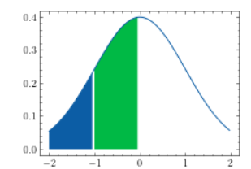
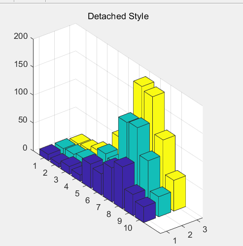

## 画图整理


### 用 science plot

#### 曲线图

```python
with plt.style.context(['science']):
    plt.plot(x1,y1,x1,y2,x1,y3)
    plt.legend(['1','2','3'])
```


#### 散点图

```python
with plt.style.context(['science', 'scatter']):
    fig, ax = plt.subplots(figsize=(4, 4))
    ax.plot([-2, 2], [-2, 2], 'k--')
    ax.fill_between([-2, 2], [-2.2, 1.8], [-1.8, 2.2],
                    color='dodgerblue', alpha=0.2, lw=0)
    for i in range(7):
        x1 = np.random.normal(0, 0.5, 10)
        y1 = x1 + np.random.normal(0, 0.2, 10)
        ax.plot(x1, y1, label=r"$^\#${}".format(i+1))
    ax.legend( loc=2, ncol=2)

    ax.set_xlim([-2, 2])
    ax.set_ylim([-2, 2])
   
```


#### 曲线拟合

```python
with plt.style.context(['science', 'scatter']):
    x = np.arange(1,17,1)
    y = np.array([4.00,6.40,8.00,8.80,9.22,9.50,9.70,9.86,10.00,10.20,10.32,10.42,10.50,10.55,10.58,10.60])
    z1 = np.polyfit(x,y,3)
    p1= np.poly1d(z1)
    yvals = p1(x)
    print(yvals)
    plot1 = plt.plot(x,y,'-',label='original values')
    plot2 = plt.plot(x,yvals,label='polyfit values')
    plt.xlabel('xaxis')
    plt.ylabel('yaxis')
    plt.legend(loc=4)  #指定legend的位置,读者可以自己help它的用法
    plt.title('polyfitting')
```


此处用的是多项式拟合, 也可以用scipy中的curve_fit函数进行拟合.

https://blog.csdn.net/Fuxiu279/article/details/88429801

#### 曲线 with  confidence band

```python
with plt.style.context(['science', 'scatter']):
    N = 21
    x = np.linspace(0, 10, 11)
    y = [3.9, 4.4, 10.8, 10.3, 11.2, 13.1, 14.1,  9.9, 13.9, 15.1, 12.5]

    # fit a linear curve an estimate its y-values and their error.
    a, b = np.polyfit(x, y, deg=1)
    y_est = a * x + b
    y_err = x.std() * np.sqrt(1/len(x) +
                              (x - x.mean())**2 / np.sum((x - x.mean())**2))

    fig, ax = plt.subplots()
    ax.plot(x, y_est, '-')
    ax.fill_between(x, y_est - y_err, y_est + y_err, alpha=0.2)
    ax.plot(x, y, 'o', color='tab:brown')
```


#### 区域填充

```python
def f(x):
    u = 0   # 均值μ
    sig = math.sqrt(1)  # 标准差δ
    y = np.exp(-(x - u) ** 2 / (2 * sig ** 2)) / (math.sqrt(2*math.pi)*sig) # 定义曲线函数
    return y

with plt.style.context(['science', 'scatter']):
    t = np.arange(-2,2,1/40.)
    plt.plot(t,f(t),'-')
    section = np.arange(-2,-1, 1/20)
    plt.fill_between(section,f(section))
    section2 = np.arange(-1,0, 1/20)                # 这里可以考虑让后者覆盖前者从而消除这个裂痕
    plt.fill_between(section2,0,f(section2))
```



这里需要注意的是, 需要使用来描述曲线

### matplotlib下不适合

#### 3D柱状图(matlab)

有些图在matlplotlib下非常丑, 所以就不适合使用scienceplots了, 只能被迫使用matlab或者seaborn了

```matlab
load count.dat
Z = count(1:10,:);
figure
bar3(Z)
title('Detached Style')
```


