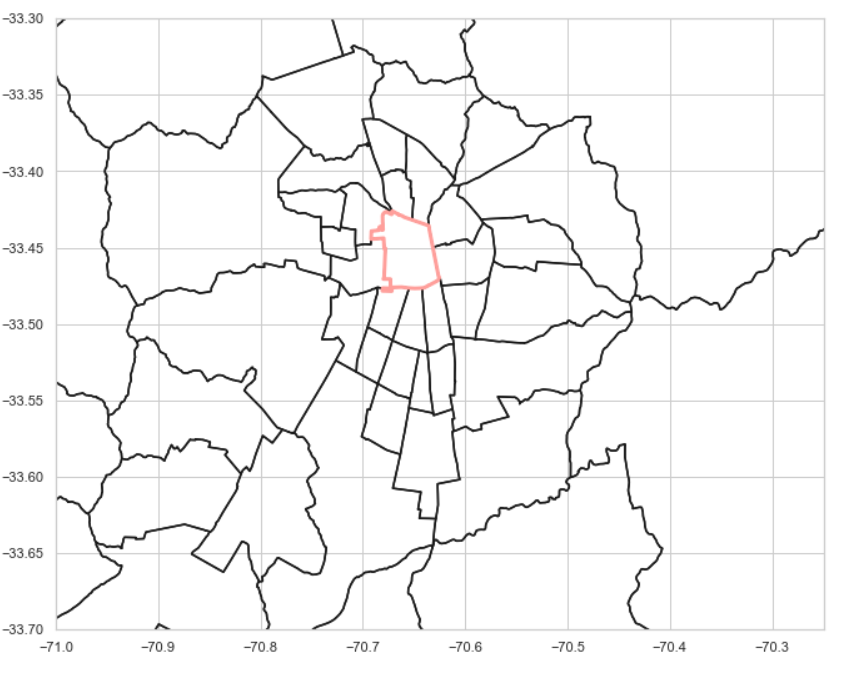
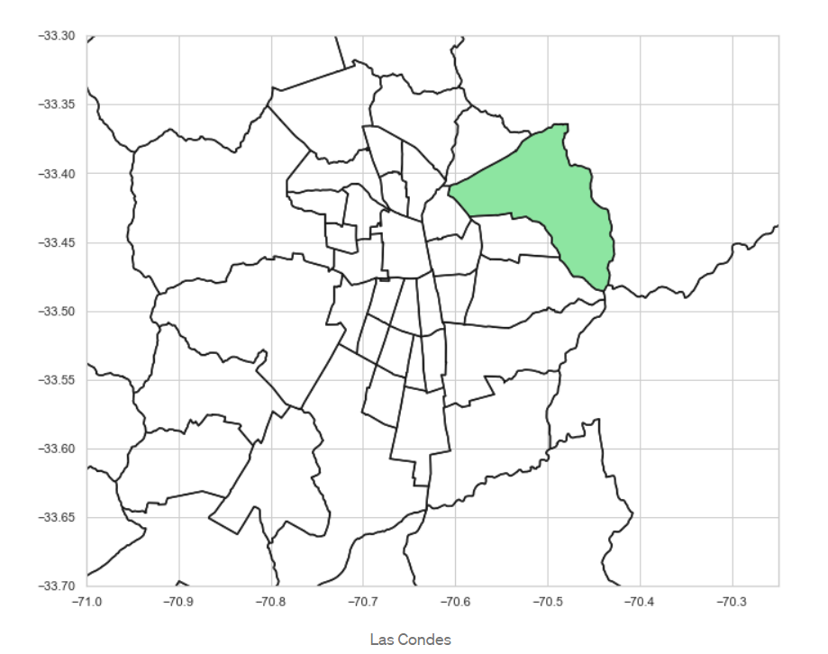
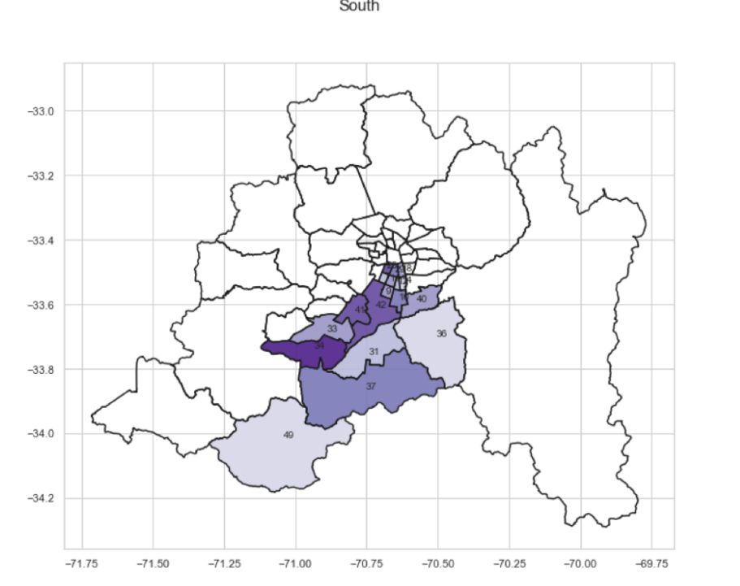
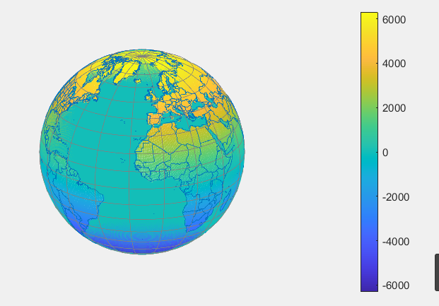
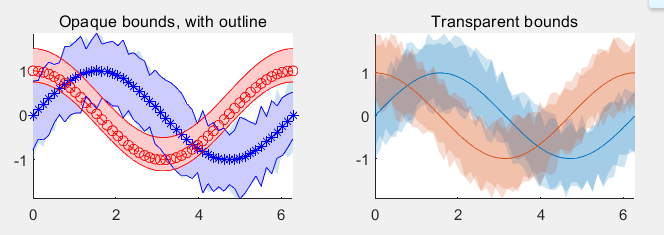
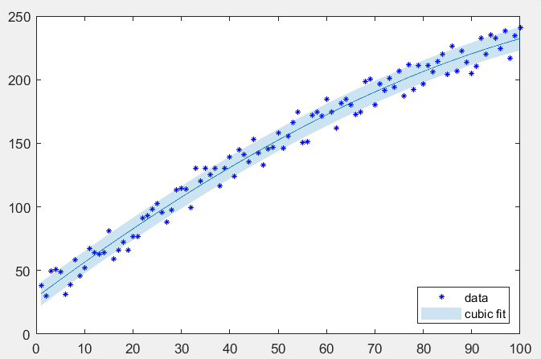
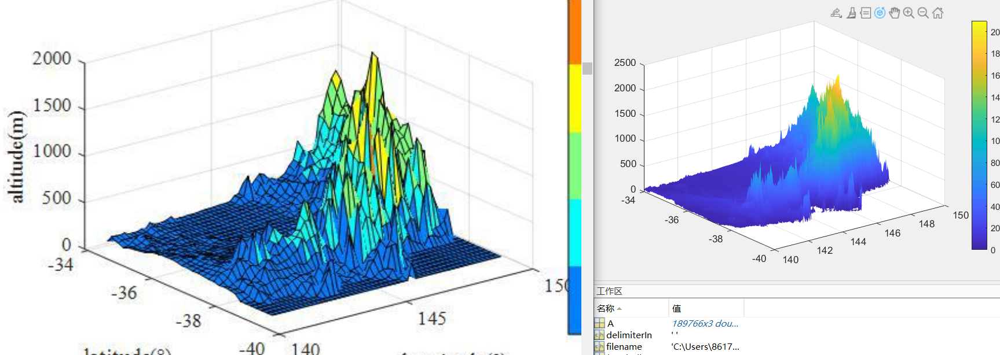
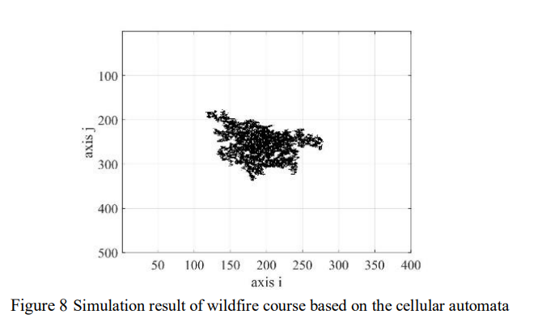
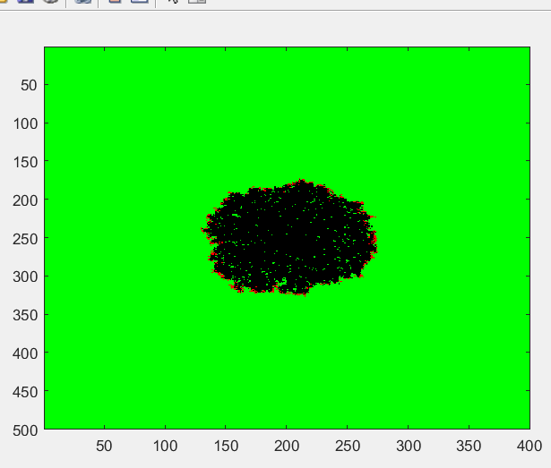
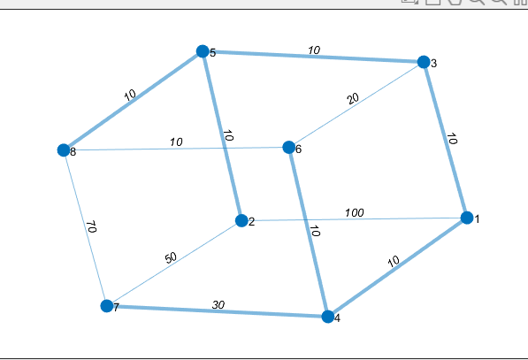

## 美赛画图与算法整理

### 山火

在澳大利亚官网能够找到2019-2020的山火详细数据

https://www.awe.gov.au/abares/forestsaustralia/forest-data-maps-and-tools/fire-data

虽然这个数据非常详细, 但是用于做预测等等是不够的


对于模型的抽象, 几乎没有论文使用森林作为标准, 只有在不足中提到森林的

网络上会存在一些已有的分析

顺着谷歌的结果向下找, 最终找到了fireHistroy的shpfile文件, 读取整个field文件需要挺长时间, 试图通过save和load来将其存储, 但是似乎速度也不快

查找资料试图找到一个可用的, 判断是什么问题

https://www.thebrandonjackson.com/shapefiles-in-matlab/

选择这篇文章中的内容, 其中提到了常用的下载shapefile的地方

> 1. NOAA  Storm Prediction Center Severe Weather GIS (SVRGIS) Page: http://www.spc.noaa.gov/gis/svrgis/
> 2. Natural Earth: http://www.naturalearthdata.com/downloads/
> 3. Free GIS Datasets: [https://freegisdata.rtwilson.com](https://freegisdata.rtwilson.com/)
> 4. US Energy Information Agency: https://www.eia.gov/maps/layer_info-m.php

坏了, 真的坏了, matlab画较多的shapefile时, 会很卡顿


试试用python画

一篇比较详细的python的shapefile相关

https://towardsdatascience.com/mapping-geograph-data-in-python-610a963d2d7f

```python
def read_shapefile(sf):
    """
    Read a shapefile into a Pandas dataframe with a 'coords' 
    column holding the geometry information. This uses the pyshp
    package
    """
    fields = [x[0] for x in sf.fields][1:]
    records = sf.records()
    shps = [s.points for s in sf.shapes()]
    df = pd.DataFrame(columns=fields, data=records)
    df = df.assign(coords=shps)
    return df

def plot_shape(id, s=None):
    """ PLOTS A SINGLE SHAPE """
    plt.figure()
    ax = plt.axes()
    ax.set_aspect('equal')
    shape_ex = sf.shape(id)
    x_lon = np.zeros((len(shape_ex.points),1))
    y_lat = np.zeros((len(shape_ex.points),1))
    for ip in range(len(shape_ex.points)):
        x_lon[ip] = shape_ex.points[ip][0]
        y_lat[ip] = shape_ex.points[ip][1]
    plt.plot(x_lon,y_lat) 
    x0 = np.mean(x_lon)
    y0 = np.mean(y_lat)
    plt.text(x0, y0, s, fontsize=10)
    # use bbox (bounding box) to set plot limits
    plt.xlim(shape_ex.bbox[0],shape_ex.bbox[2])
    return x0, y0

def plot_map(sf, x_lim = None, y_lim = None, figsize = (11,9)):
    '''
    Plot map with lim coordinates
    '''
    plt.figure(figsize = figsize)
    id=0
    for shape in sf.shapeRecords():
        x = [i[0] for i in shape.shape.points[:]]
        y = [i[1] for i in shape.shape.points[:]]
        plt.plot(x, y, 'k')
        
        if (x_lim == None) & (y_lim == None):
            x0 = np.mean(x)
            y0 = np.mean(y)
            plt.text(x0, y0, id, fontsize=10)
        id = id+1
    
    if (x_lim != None) & (y_lim != None):     
        plt.xlim(x_lim)
        plt.ylim(y_lim)

def plot_map_fill(id, sf, x_lim = None, 
                          y_lim = None, 
                          figsize = (11,9), 
                          color = 'r'):
    '''
    Plot map with lim coordinates
    '''
    
    plt.figure(figsize = figsize)
    fig, ax = plt.subplots(figsize = figsize)
    for shape in sf.shapeRecords():
        x = [i[0] for i in shape.shape.points[:]]
        y = [i[1] for i in shape.shape.points[:]]
        ax.plot(x, y, 'k')
        
    shape_ex = sf.shape(id)
    x_lon = np.zeros((len(shape_ex.points),1))
    y_lat = np.zeros((len(shape_ex.points),1))
    for ip in range(len(shape_ex.points)):
        x_lon[ip] = shape_ex.points[ip][0]
        y_lat[ip] = shape_ex.points[ip][1]
    ax.fill(x_lon,y_lat, color)
    
    if (x_lim != None) & (y_lim != None):     
        plt.xlim(x_lim)
        plt.ylim(y_lim)        
   

def plot_map_fill_multiples_ids(title, comuna, sf, 
                                               x_lim = None, 
                                               y_lim = None, 
                                               figsize = (11,9), 
                                               color = 'r'):
    '''
    Plot map with lim coordinates
    '''
    
    plt.figure(figsize = figsize)
    fig, ax = plt.subplots(figsize = figsize)
    fig.suptitle(title, fontsize=16)
    for shape in sf.shapeRecords():
        x = [i[0] for i in shape.shape.points[:]]
        y = [i[1] for i in shape.shape.points[:]]
        ax.plot(x, y, 'k')
            
    for id in comuna:
        shape_ex = sf.shape(id)
        x_lon = np.zeros((len(shape_ex.points),1))
        y_lat = np.zeros((len(shape_ex.points),1))
        for ip in range(len(shape_ex.points)):
            x_lon[ip] = shape_ex.points[ip][0]
            y_lat[ip] = shape_ex.points[ip][1]
        ax.fill(x_lon,y_lat, color)
             
        x0 = np.mean(x_lon)
        y0 = np.mean(y_lat)
        plt.text(x0, y0, id, fontsize=10)
    
    if (x_lim != None) & (y_lim != None):     
        plt.xlim(x_lim)
        plt.ylim(y_lim)        

        
def plot_comunas_2(sf, title, comunas, color):
    '''
    Plot map with selected comunes, using specific color
    '''
    
    df = read_shapefile(sf)
    comuna_id = []
    for i in comunas:
        comuna_id.append(df[df.NOM_COMUNA == i.upper()]
                         .index.get_values()[0])
    plot_map_fill_multiples_ids(title, comuna_id, sf, 
                                       x_lim = None, 
                                       y_lim = None, 
                                       figsize = (11,9), 
                                       color = color);
        
df = read_shapefile(sf)   # 这里shapefile转dataframe
df.shape


comuna = 'SANTIAGO'
com_id = df[df.NOM_COMUNA == comuna].index.get_values()[0]
plot_shape(com_id, comuna)

```









可以看到的是, 代码量还是比较大的


试图画出地球



m_map不支持对地球这个projection进行pcolor


**误差/置信边界绘制着色**

cdt中的boundedline函数

cdt文档的546页

关键代码

```matlab
[l,p] = boundedline(x, y1, e1, '-b*', x, y2, e2, '--ro');
outlinebounds(l,p);
```

加上个alpha会更漂亮, 不要花里胡哨的配色, 直接细线＋alpha, 比较好看.



另外一种画置信区间的方式

```matlab
[g, dy] = findgroups(doy(S.t));
icemin = splitapply(@min, S.extent_N, g);
icemax = splitapply(@max, S.extent_N, g);
icemean = splitapply(@mean, S.extent_N, g);
bnd = [icemean - icemin, icemax - icemean];
cla;
boundedline(dy, icemean, bnd);
```


**拟合时的误差**

```matlab
clf
x = 1:100;
y = 12 - 0.01*x.^2 + 3*x + sind(x) + 30*rand(size(x));
h = plot(x,y,'*','color','b');
set(h,'MarkerSize',3);
hold on

polyplot(x,y,3,'error','alpha');
legend('data','cubic fit','location','southeast')
```




**画之前的海拔图**

就是直接数据处理以后用surf函数




**元胞自动机**

当初没有看懂这个图是啥



今天跑了他的代码, 知道了, 是他的仿真结果



拜读了一下他的代码, 代码可读性不好, 但是很**短**

```matlab
a = 500;
b = 400;
k = 0.005;
veg = 5*ones(a,b);
imh = image(cat(3,veg,veg,veg));
W = fspecial('gaussian',[51,51],0.9); 
vegpast = zeros(a,b);
resultmat = zeros(5,25);
for burn = 0.6:0.02:1
 for turn = 1:5
     veg=5*ones(a,b);
     veg(a/2:a/2+1,b/2:b/2+1)=[4 4;4 4];
 for i=1:1000 
 vegpast = veg;
 vegavg = imfilter(double(veg<5&veg>1), W, 'replicate');
 veg = veg - 1 + (veg==5) + (veg==0) + (veg<0) ...
 - (veg==5).*(vegavg >= burn * rand(a,b)) ...
 - 5*((1<veg&veg<5).*rand(a,b) > exp(-k*i));
 set(imh, 'cdata', cat(3,(1<veg&veg<5),(veg==5),zeros(a,b)));
 drawnow
 if sum(sum((vegpast==5) == (veg==5))) == a * b
 break;
 end
 end
 resultmat(turn,int16(50*burn-29)) = a*b-sum(sum((veg==5)));
 end
end
```

此处用到高斯滤波器的函数是fspecial和imfilter

高斯滤波是啥?

高斯滤波是一种线性平滑滤波，适用于消除高斯噪声，广泛应用于图像处理的减噪过程

**每一个像素点的值，都由其本身和邻域内的其他像素值经过加权平均后得到**

(文章2105363中的卷积)


**kruskal最小生成树算法**

matlab中的, 直接官网中的, 代码非常短, 很简洁

```matlab
s = [1 1 1 2 5 3 6 4 7 8 8 8];
t = [2 3 4 5 3 6 4 7 2 6 7 5];
weights = [100 10 10 10 10 20 10 30 50 10 70 10];
G = graph(s,t,weights);
p = plot(G,'EdgeLabel',G.Edges.Weight);
[T,pred] = minspantree(G);
highlight(p,T)
```



 也准备了一份python的代码, matlab短是因为封装, 这里python我就能更多细节的修改.

```python
from collections import defaultdict
# Part of Cosmos by OpenGenus Foundation
class Graph: 
    def __init__(self,vertices):
        self.V= vertices
        self.graph = [] 
    def addEdge(self,u,v,w):
        self.graph.append([u,v,w])
    def find(self, parent, i):
        if parent[i] == i:
            return i
        return self.find(parent, parent[i])
    def union(self, parent, rank, x, y):
        xroot = self.find(parent, x)
        yroot = self.find(parent, y)
        if rank[xroot] < rank[yroot]:
            parent[xroot] = yroot
        elif rank[xroot] > rank[yroot]:
            parent[yroot] = xroot
        else :
            parent[yroot] = xroot
            rank[xroot] += 1
    def KruskalMST(self):
        result =[]
        i,e = 0,0 
        self.graph =  sorted(self.graph,key=lambda item: item[2])
        parent = [] ; rank = []
        for node in range(self.V):
            parent.append(node)
            rank.append(0) 
        while e < self.V -1 :
            u,v,w =  self.graph[i]
            i = i + 1
            x = self.find(parent, u)
            y = self.find(parent ,v)
            if x != y:
                e = e + 1  
                result.append([u,v,w])
                self.union(parent, rank, x, y)          
        print("Constructed MST :")
        print("Vertex A    Vertex B  Weight")
        for u,v,weight  in result:
            print ("    %d          %d        %d" % (u,v,weight))
#vetx = int(input("Enter no. of vertices :"))
eegde = int(input("Enter no. of edges :"))
g = Graph(eegde-1)
print("For each edge input (Source vertex , Destination vertex , Weight of the edge ) :")
for x in range(eegde):
    qq,xx,yy = map(int,input().split(" "))    
    g.addEdge(qq, xx, yy)
g.KruskalMST()
```

**K-means算法**

python自己有轮子

```matlab
from sklearn.cluster import KMeans
import numpy as np
X = np.array([[1, 2], [1, 4], [1, 0],
              [10, 2], [10, 4], [10, 0]]) # 这里是点的位置
kmeans = KMeans(n_clusters=2, random_state=0).fit(X)
kmeans.labels_

kmeans.predict([[0, 0], [12, 3]]) # 这里是预测

kmeans.cluster_centers_
```

matlab也有,可以直接调接口, 还没有研究接口详情, 因为应该问题不大就是idx = kmeans(X,k)


